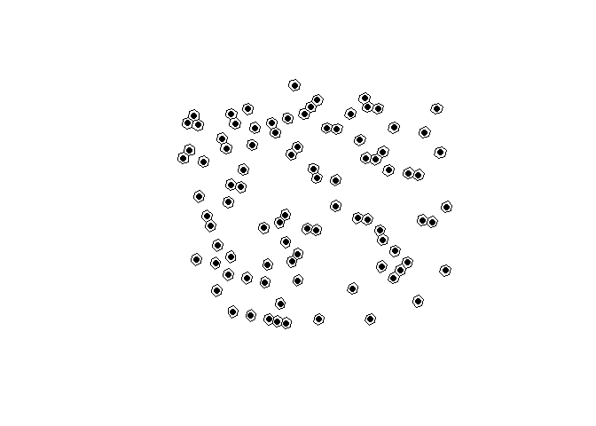

The extendr-powered R package `h3o` provides access to [a pure Rust implementation](https://github.com/HydroniumLabs/h3o)
of [Uber's H3 Geospatial Indexing System](https://github.com/uber/h3).
Originally developed by Josiah Parry, the R package has also become an official
product of extendr, which means community support 🤝 and maintenance 🏗️ into
the foreseeable future.

## `h3o` at a glance 👀

The package provides functionality to interact with H3's grid as vectors, which
can be converted to and from `sf` geometries.

``` r
library(h3o)
library(dplyr)
library(sf)
library(tibble)

xy <- data.frame(
  x = runif(100, -5, 10),
  y = runif(100, 40, 50)
)

pnts <- st_as_sf(
  xy,
  coords = c("x", "y"),
  crs = 4326
)

mutate(pnts, h3 = h3_from_points(geometry, 5))
```

    Simple feature collection with 100 features and 1 field
    Geometry type: POINT
    Dimension:     XY
    Bounding box:  xmin: -4.984449 ymin: 40.02991 xmax: 9.927412 ymax: 49.57376
    Geodetic CRS:  WGS 84
    First 10 features:
                          geometry              h3
    1    POINT (6.615273 41.88461) 85394d9bfffffff
    2  POINT (-0.5700488 41.87264) 853970b3fffffff
    3    POINT (-2.33205 41.95537) 8539292ffffffff
    4   POINT (-2.450051 47.21917) 85184557fffffff
    5    POINT (6.373951 47.05955) 851f8203fffffff
    6    POINT (3.287704 44.73006) 851f921bfffffff
    7    POINT (1.477562 42.97844) 853962b7fffffff
    8   POINT (0.5357143 44.39415) 8539641bfffffff
    9     POINT (1.97672 48.76817) 851fb47bfffffff
    10  POINT (-4.807255 48.05959) 851846cffffffff

You can use the `st_as_sfc()` method to convert H3 hexagons to sf `POLYGON`s.

``` r
# replace geometry
h3_cells <- pnts |>
  mutate(
    h3 = h3_from_points(geometry, 4),
    geometry = st_as_sfc(h3)
  )

# plot the hexagons
plot(st_geometry(h3_cells))
```


H3 cell centroids can be returned using `h3_to_points()`. If `sf` is avilable,
the results will be returned as an `sfc` (sf column) object. Otherwise it will
return a list of `sfg` (sf geometries).

``` r
# fetch h3 column
h3s <- h3_cells[["h3"]]

# get there centers
h3_centers <- h3_to_points(h3s)

# plot the hexagons with the centers
plot(st_geometry(h3_cells))
plot(h3_centers, pch = 16, add = TRUE, col = "black")
```



## H3 at light speed ⚡

Because it builds on a pure Rust implementation, `h3o` is also very very fast.
Here are some benchmarks, which also serve to showcase `h3o` tools.

### Creating polygons

``` r
h3_strs <- as.character(h3s)
bench::mark(
  h3o = st_as_sfc(h3s),
  h3jsr = h3jsr::cell_to_polygon(h3_strs),
  relative = TRUE
)
```

    # A tibble: 2 × 6
      expression   min median `itr/sec` mem_alloc `gc/sec`
      <bch:expr> <dbl>  <dbl>     <dbl>     <dbl>    <dbl>
    1 h3o          1      1        15.6        1      1   
    2 h3jsr       17.8   17.3       1        274.     7.96

### Converting polygons to H3 cells:

``` r
nc <- st_read(system.file("gpkg/nc.gpkg", package = "sf"), quiet = TRUE) |>
  st_transform(4326) |>
  st_geometry()

bench::mark(
  h3o = sfc_to_cells(nc, 5, "centroid"),
  h3jsr = h3jsr::polygon_to_cells(nc, 5),
  check = FALSE,
  relative = TRUE
)
```

    # A tibble: 2 × 6
      expression   min median `itr/sec` mem_alloc `gc/sec`
      <bch:expr> <dbl>  <dbl>     <dbl>     <dbl>    <dbl>
    1 h3o         1      1         5.42       1       2.26
    2 h3jsr       5.81   5.61      1         34.1     1   

### Converting points to cells

``` r
bench::mark(
  h3o = h3_from_points(pnts$geometry, 3),
  h3jsr = h3jsr::point_to_cell(pnts$geometry, 3),
  check = FALSE,
  relative = TRUE
)
```

    # A tibble: 2 × 6
      expression   min median `itr/sec` mem_alloc `gc/sec`
      <bch:expr> <dbl>  <dbl>     <dbl>     <dbl>    <dbl>
    1 h3o          1      1        21.2        1      1.03
    2 h3jsr       21.2   23.0       1        955.     1   

### Retrieve edges

``` r
bench::mark(
  h3o = h3_edges(h3s),
  h3jsr = h3jsr::get_udedges(h3_strs),
  check = FALSE,
  relative = TRUE
)
```

    # A tibble: 2 × 6
      expression   min median `itr/sec` mem_alloc `gc/sec`
      <bch:expr> <dbl>  <dbl>     <dbl>     <dbl>    <dbl>
    1 h3o         1      1         2.90      1        1.07
    2 h3jsr       4.38   3.14      1         7.02     1   

### Get origins and destinations from edges.

``` r
# get edges for a single location
eds <- h3_edges(h3s[1])[[1]]
# strings for h3jsr
eds_str <- as.character(eds)

bench::mark(
  h3o = h3_edge_cells(eds),
  h3jsr = h3jsr::get_udends(eds_str),
  check = FALSE,
  relative = TRUE
)
```

    # A tibble: 2 × 6
      expression   min median `itr/sec` mem_alloc `gc/sec`
      <bch:expr> <dbl>  <dbl>     <dbl>     <dbl>    <dbl>
    1 h3o          1      1        37.9      1        1.00
    2 h3jsr       48.2   38.6       1        2.52     1   

## Installation 📦

You can install the release version of `h3o` from CRAN with:

``` r
install.packages("h3o")
```

Or you can install the development version from [GitHub](https://github.com/)
with:

``` r
# install.packages("pak")
pak::pak("extendr/h3o")
```

## Learn more 🧑‍🎓

See the package documentation for more details: <http://extendr.rs/h3o/>.

If you encounter a bug or would like to request new features, head over to the
GitHub repository: <https://github.com/extendr/h3o>.
